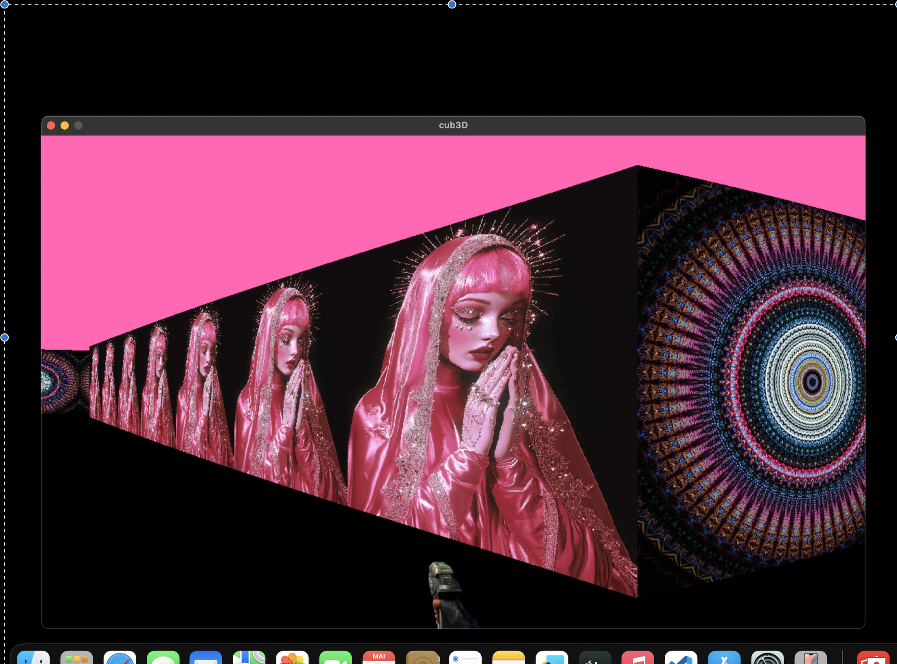
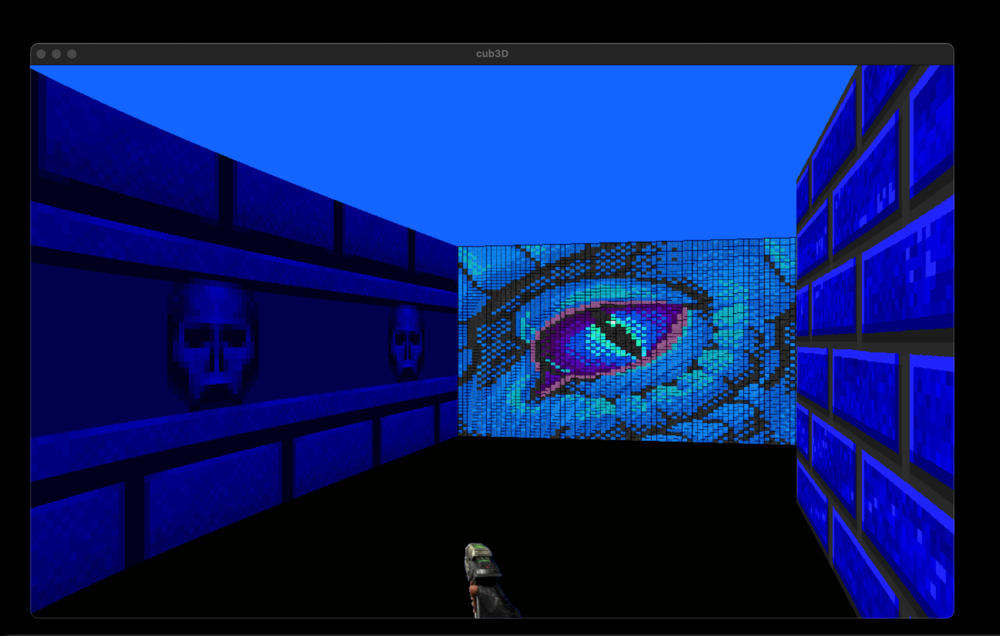
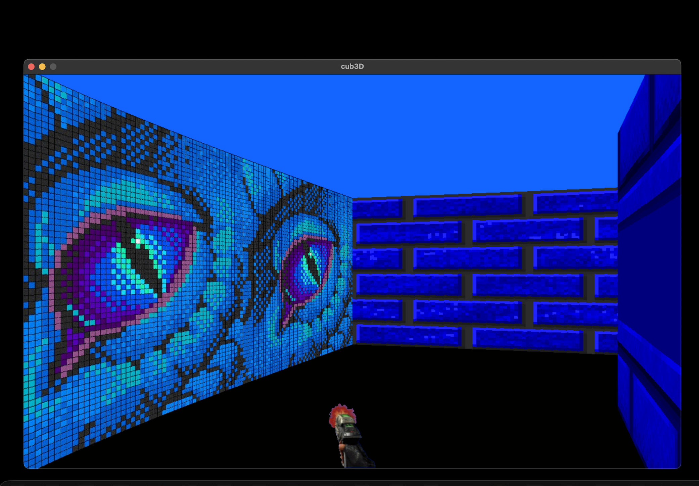

# Cub3D

## Introduction

Cub3D est un projet inspiré du jeu **Wolfenstein 3D**, permettant d'explorer la technique du **raycasting**. L'objectif est de créer un environnement dynamique sous forme de labyrinthe, dans lequel le joueur doit trouver un chemin. Ce projet constitue une excellente introduction aux applications pratiques des mathématiques en informatique graphique, sans nécessiter une compréhension approfondie des concepts avancés en 3D.

## Raycasting

Le **raycasting** est une technique de rendu utilisée en synthèse d'image pour simuler un environnement 3D à partir d'un espace en 2D. Contrairement aux moteurs graphiques basés sur des modèles 3D complets, le raycasting fonctionne en projetant des rayons dans l'espace afin de détecter les obstacles et de calculer l'affichage des surfaces visibles.

## Étapes du Raycasting

### 1. Lancer des rayons
Chaque rayon est envoyé depuis la position de la caméra en suivant différentes directions correspondant aux colonnes de pixels de l'écran.  
L'angle de chaque rayon est déterminé par le champ de vision du joueur.

### 2. Détection des collisions avec les murs
Chaque rayon avance jusqu'à rencontrer un obstacle (un mur dans le labyrinthe).  
Le point d'intersection avec le mur est calculé en utilisant des techniques de détection de collision, telles que l'**algorithme DDA** ou l'**algorithme de Bresenham**.

### 3. Calcul de la distance et correction de la perspective
Une fois un mur détecté, la distance entre la caméra et le point d'intersection est mesurée.  
Cette distance est ajustée pour éviter la distorsion due à la projection en 2D.

### 4. Projection sur l'écran
La hauteur de chaque mur est déterminée en fonction de la distance calculée.  
Les murs plus proches apparaissent plus grands, tandis que les murs éloignés sont plus petits.

### 5. Dessin des murs
Une fois la hauteur du mur déterminée, chaque colonne de pixels de l'écran est remplie en conséquence.  
Les couleurs ou textures des murs sont appliquées en fonction du point d'impact du rayon.  
Un effet d'ombrage peut être ajouté en ajustant la luminosité selon l'angle d'incidence du rayon.  
Un fond de ciel et un sol sont souvent ajoutés pour améliorer l'immersion.

### 6. Gestion des textures et de l'éclairage
Chaque surface peut être texturée pour un rendu plus réaliste.  
Des effets de lumière peuvent être appliqués en ajustant la luminosité selon la distance.

### 7. Optimisation avec les secteurs et les portails
On ne lance des rayons que dans les secteurs visibles où se trouve la caméra.  
Les secteurs adjacents sont explorés récursivement en ajustant les cônes de vision.  
La recherche s'arrête lorsque les rayons ne traversent plus de portails connectant les secteurs.

## Conclusion

Cub3D est un excellent terrain d'expérimentation pour comprendre le raycasting et son utilisation dans les jeux vidéo.  
En optimisant les calculs et en appliquant des techniques avancées comme l'**arbre BSP** et le **Z-ordering**, il est possible d'obtenir un rendu fluide et efficace même sur des machines aux ressources limitées.

## Aperçu du projet

### Capture 1

### Capture 2

### Capture 3

## 📌 À propos du projet

Ce projet a été réalisé par **deux personnes** et séparé en **deux parties** principales :
- 🎯 **Raycasting** : traitement et rendu graphique en pseudo-3D à partir de rayons
- 🧱 **Parcing** : lecture et validation de la carte et des ressources
